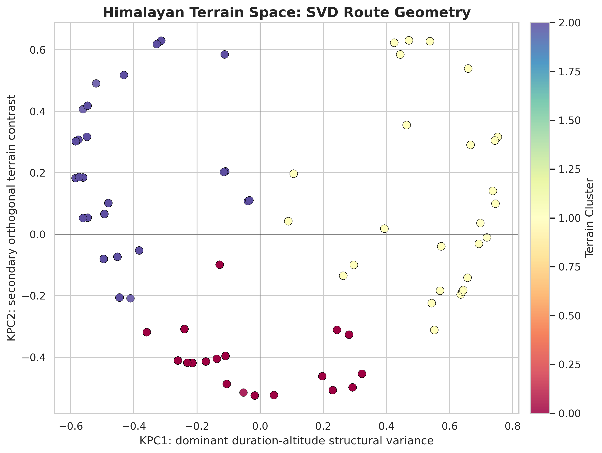
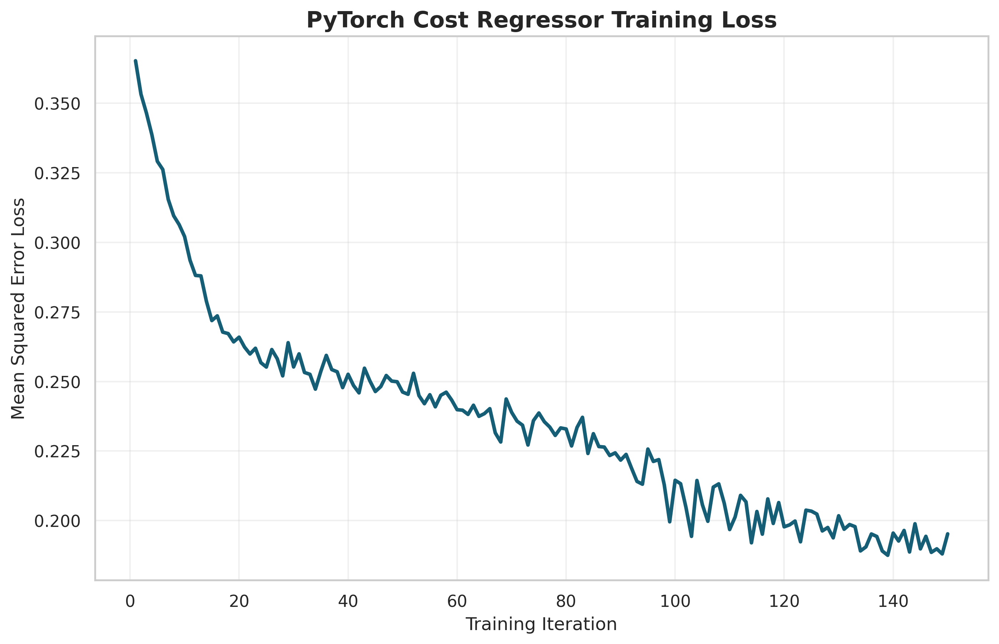

# HimalayaGuard - Capstone Project

<p align="center">
  
  
  
  
</p>

---

## Overview

This is a multi-modal machine learning framework designed to transform raw trekking data into actionable route intelligence. Using historical Himalayan trek data, the system learns latent non-linear terrain structures, groups routes with similar geometric traits, and predicts operational costs through an optimized fused-feature deep learning pipeline. Rather than forcing path-dependent mountain data onto straight lines, HimalayaGuard uses non-linear manifold learning to build a compact, structurally sound representation of the journey itself—capturing how duration, altitude, and difficulty scale together across routes.

> **Know what awaits ahead before taking the first step.**

---

## Features

### Data Engineering
- Robust preprocessing and feature extraction via regular expressions
- Cost normalization and multi-currency string parsing
- Custom categorical consolidation to remove semantic noise and reduce sparsity
- Missing value fallback handling and data distribution validation

### Custom Non-Linear Algebra Pipeline
- Hand-engineered Radial Basis Function (RBF) Kernel PCA implemented from scratch
- Pairwise Euclidean distance matrix transformations and custom kernel centering
- Non-linear terrain-space projections bypassing rigid linear abstractions
- Pairwise structural similarity mapping using localized geodesic variance

### Himalayan Terrain Space
Routes are projected into a latent non-linear geometric space where similar treks naturally cluster together. This manifold successfully captures hidden structural patterns between:

- Trek duration scales
- Maximum altitude tracking
- Ordinal route difficulty metrics

### Feature Fusion
Combines:

- Latent non-linear terrain embeddings (KPC1, KPC2)
- Consolidated low-cardinality ordinal difficulty tiers

into a compact, dense matrix optimized for stable machine learning operations.

### Deep Learning Cost Prediction
PyTorch-based robust regression model that learns:

```
Non-Linear Terrain Emb. (KPC1, KPC2)
                 +
Consolidated Ordinal Difficulty Tier
                 ↓
Estimated Trek Cost (Huber Constrained)
```

---

## Architecture

```text
┌─────────────────────────────┐
│        Trek Data.csv        │
└──────────────┬──────────────┘
               │
               ▼
┌─────────────────────────────┐
│      Data Engineering       │
│  Ordinal Tier Consolidation │
└──────────────┬──────────────┘
               │
               ▼
┌─────────────────────────────┐
│       Standardization       │
└──────────────┬──────────────┘
               │
               ▼
┌─────────────────────────────┐
│   Custom RBF Kernel PCA     │
│   Non-Linear Projection     │
└──────────────┬──────────────┘
               │
               ▼
┌─────────────────────────────┐
│       Feature Fusion        │
│    KPC1 + KPC2 + Ordinal    │
└──────────────┬──────────────┘
               │
               ▼
┌─────────────────────────────┐
│  Robust PyTorch Regressor   │
│    (Smooth L1 Huber Loss)   │
└──────────────┬──────────────┘
               │
               ▼
┌─────────────────────────────┐
│    Cost Estimation Engine   │
└─────────────────────────────┘
```

---

## Core Methodology

### 1. Route Feature Engineering
Raw trekking metadata is converted into structured, dense numerical representations. To prevent column explosion and eliminate semantic noise caused by inconsistent agency tagging (e.g., matching "Moderate-Hard" vs. "Demanding"), loose categories are mapped into a clean, low-cardinality ordinal matrix tracking absolute intensity.

### 2. Terrain Space Construction
After dimension standardization, a custom Radial Basis Function (RBF) Kernel PCA is applied from scratch:

```math
K(x, y) = \exp(-\gamma ||x - y||^2)
```
```math
K_{centered} = K - I_n K - K I_n + I_n K I_n
```

Applying Singular Value Decomposition directly to the centered non-linear similarity matrix ($K_{centered}$) extracts the principal eigenvectors, allowing the system to unroll path-dependent terrain variations.

### 3. Latent Route Representation
Each trek receives:

- KPC1 coordinate (Kernel Principal Component 1)
- KPC2 coordinate (Kernel Principal Component 2)

representing its accurate location within the unrolled non-linear terrain manifold.

### 4. Neural Cost Regression
Fused multi-modal feature matrices are evaluated by a deep Multi-Layer Perceptron (MLP) built in PyTorch. The network utilizes:

- **Smooth L1 (Huber) Loss:** Protects the optimization process against gradient explosion caused by out-of-distribution luxury price anomalies (such as private helicopter-shuttle tours).
- **Adam Optimization:** Manages adaptive learning rate parameters ($\alpha = 0.01$).
- **Dropout Regularization:** Prevents over-indexing on localized dataset noise.

---

## Running the Project

```bash
uv sync
uv run python main.py
```

or launch the notebook:

```bash
jupyter notebook main.ipynb
```

---

## Outputs

The project produces:

- Clean engineered trekking dataset with consolidated ordinal features
- Non-linear kernel space manifold coordinates
- Descriptive cluster archetype summaries
- High-resolution data scatter plots mapping the RBF terrain manifold
- Robust neural-network training curves
- Scaled log cost predictions

---

## Results

### Kernel PCA Terrain Space


### Robust Training Loss Convergence

